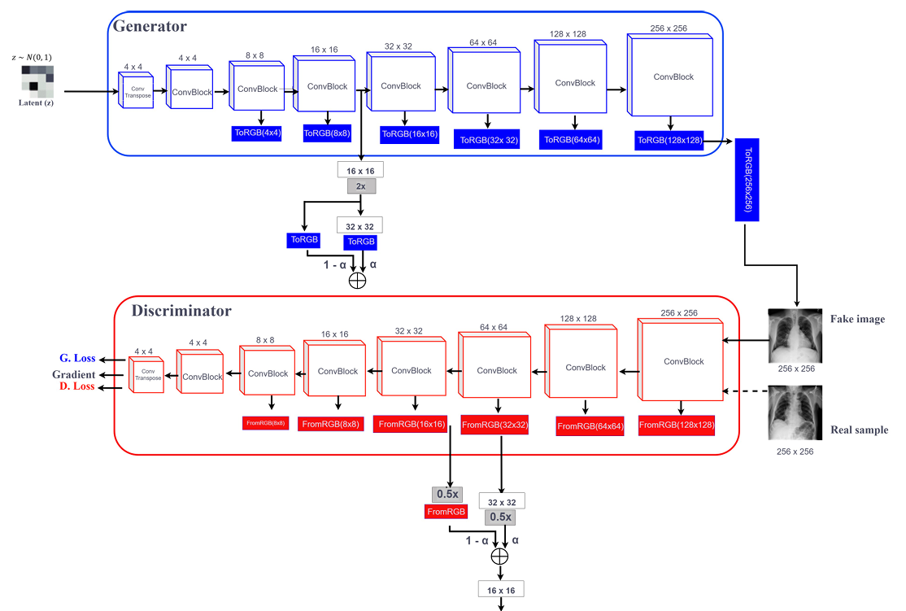
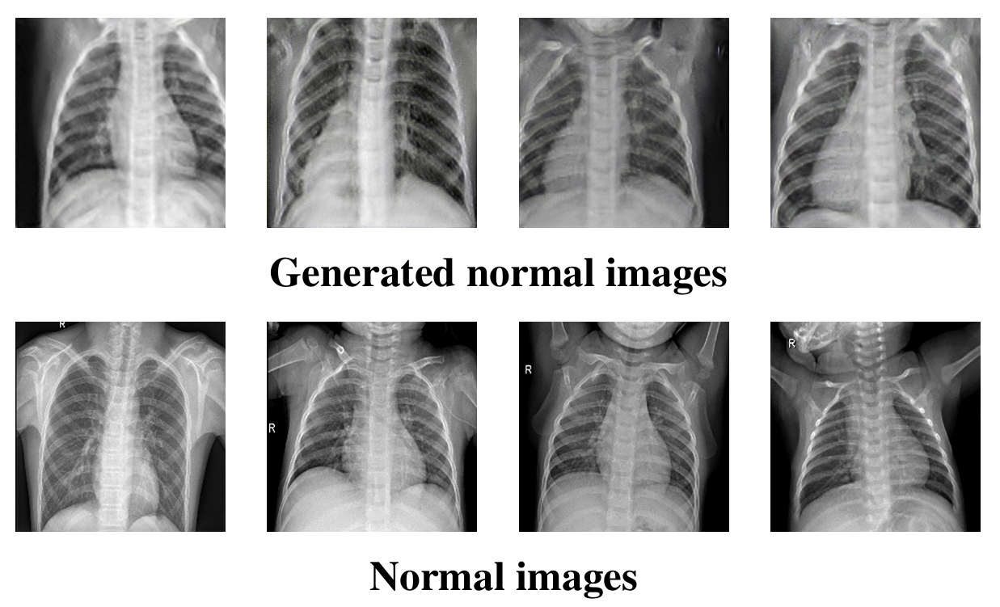

<div style="display: flex; gap: 10px;">
  
  
</div>
# Optimized-PGGAN-Based-Approach-for-Data-Augmentation-in-Medical-Images
This repository contains the implementation and experimental results of generative models for chest X-ray image synthesis using Progressive Growing Generative Adversarial Networks (PGGANs). 


The paper (Link):

An Optimized PGGAN-Based
Approach for Data Augmentation in
Medical Images

Authors:

Zinga Banda Firmino René

Ali Sahib Abosinnee

---

# Table of Contents

1. [Abstract](#1-abstract)

2. [Our Contributions](#2-our-contributions)

3. [Repository Contents](#3-repository-contents)

4. [Installation](#4-installation)

5. [Methodology](#5-methodology)

6. [Dataset](#6-dataset)

7. [Code Execution Guide](#7-code-execution-guide)

   - [7.1 Training the VGG16 Model](#71-training-the-vgg16-model)
   - [7.2 Training the Custom CNN Model](#72-training-the-custom-cnn-model)
   - [7.3 Training the DDPM Model](#73-training-the-ddpm-model)
   - [7.4 Training the PGGANs Model](#74-training-the-pggans-model)
   - [7.5 Calculating the FID Scores](#75-calculating-the-fid-scores)

8. [Results](#8-results)

9. [FAQ and Citation Guidelines](#9-faq-and-citation-guidelines)

   - [9.1 Frequently Asked Questions](#91-frequently-asked-questions)
   - [9.2 Citation Guidelines](#92-citation-guidelines)

---

# 1. Abstract

Medical image datasets are often small and imbalanced, which significantly limits the performance of deep learning models used for diagnosis.

This project explores the use of two generative models:

- **Progressive Growing Generative Adversarial Networks (PGGANs)**

The models generate **synthetic chest X-ray images** which are used to augment the training datasets.

The generated images are evaluated based on their impact on the performance of classification model:

- Densenet121

Experimental results show that synthetic images significantly improve **classification accuracy, and robustness**.

For more details please refer to the paper included in this repository.

---

# 2. Our Contributions

### Evaluation Framework

A complete framework for evaluating the quality of synthetic medical images generated by **PGGAN model**.

### High Quality Image Generation

Demonstrates that **high-quality synthetic chest X-ray images** can be generated even when the original dataset is small.

### Accuracy Improvement

Using synthetic images in the training set improves classification model accuracy.

### Increased Robustness

Synthetic augmentation increases the robustness of deep learning classifiers.

### Faster Convergence

Training converges faster when synthetic samples are included.

---

# 3. Repository Contents
.
├── Cite us
│ └── README.md
├── Codes
│ ├── Classification Models
│ │ ├── VGG_help.py
│ │ ├── plots.py
│ │ ├── pretrained_balanced-VGG_ResNet-epo5.ipynb
│ │ ├── pretrained_imbalanced-VGG_ResNet-epo5.ipynb
│ │ ├── untrained_balanced-VGG_ResNet.ipynb
│ │ └── untrained_imbalanced-VGG_ResNet.ipynb
│ ├── DDPM
│ │ └── DDPM_Pytorch.ipynb
│ ├── FID
│ │ ├── FID.ipynb
│ │ ├── fid_plot.ipynb
│ │ └── Results.txt
│ └── PGGANs
│ ├── progan_modules.py
│ └── train.py
├── Dataset
├── Figures
├── Results
├── README.md
├── LICENSE
├── environment.yml
└── requirements.txt

---

# 4. Installation

### Step 1

Please consider **starring the repository ⭐** to support its development.

---

### Step 2

Fork the repository to your GitHub account.

---

### Step 3

Clone the repository:

```bash
git clone https://github.com/your-username/DDPM_X-Ray.git
cd DDPM_X-Ray
```
Step 4

Install the required dependencies.

Method 1: Using Conda

Create environment:

```bash
conda env create -f environment.yml
```

Method 2: Using venv

Create environment:

```bash
conda activate DDPM-X-Ray
```
Activate environment:

Windows
```bash
python -m venv DDPM_X-Ray
```
Linux / Mac
```bash
source DDPM_X-Ray/bin/activate
```
Install dependencies:
```bash
pip install -r requirements.txt
```
5. Methodology

The overall pipeline of this project is illustrated below.

The pipeline consists of:

Dataset preparation

Synthetic image generation

Dataset augmentation

Classification model training

Performance evaluation

6. Dataset

The dataset used consists of Chest X-ray images with two classes:

NORMAL

PNEUMONIA

Dataset structure:

dataset/
   NORMAL/
   PNEUMONIA/
   
7. Code Execution Guide
7.1 Training the VGG16 Model

Prepare dataset:
```bash
from VGG_help import prepare_dataset

dataset_dir = 'path/to/dataset'
class_labels = ['NORMAL', 'PNEUMONIA']

X, y = prepare_dataset(dataset_dir, class_labels)
```
Train VGG16 using cross validation:
```bash
from VGG_help import cv_train_vgg_model

fold_metrics_df, best_model = cv_train_vgg_model(X, y)
```
7.2 Training the Custom CNN Model
```bash
from CNN_Classification import fit_classification_model_cv

fold_metrics_df, best_model = fit_classification_model_cv(X, y)
```
7.3 Training the DDPM Model
Open the notebook:
```bash
Codes/DDPM/DDPM_Pytorch.ipynb
```
7.4 Training the PGGANs Model
Train using:
```bash
python train.py --path path/to/dataset --trial_name trial1 --gpu_id 0
```
7.5 Calculating the FID Scores
Open the notebook:
```bash
Codes/FID/fid_plot.ipynb
```
9. FAQ and Citation Guidelines
9.1 Frequently Asked Questions

If you have questions or issues please contact:

Iman Khazrak
ikhazra@bgsu.edu

Mostafa Rezaee
mostam@bgsu.edu

9.2 Citation Guidelines

If you find this work useful please cite:

IEEE Style

I. Khazrak et al.,
"Addressing Small and Imbalanced Medical Image Datasets Using Generative Models:
A Comparative Study of DDPM and PGGANs with Random and Greedy-K Sampling,"
arXiv preprint, 2024.

```bash
@misc{khazrak2024addressingsmallimbalancedmedical,
title={Addressing Small and Imbalanced Medical Image Datasets Using Generative Models},
author={Iman Khazrak and Shakhnoza Takhirova and Mostafa M. Rezaee and Mehrdad Yadollahi},
year={2024},
eprint={2412.12532},
archivePrefix={arXiv},
primaryClass={cs.CV}
}
```
